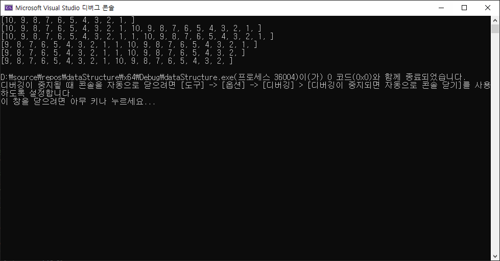

# 목표

자료구조 복습을 할때 가장 중요하게 생각한 부분은 바로 클래스로 구현 및 활용이였다.

이를 위해 List를 인터페이스 클래스로 만들었으니 이번에는 ArrayList를 구현해보자


# ArrayList 구현

### 코드

```c++
#pragma once
#include "IList.h"
#include "Exception.h"
#include <vector>

constexpr size_t NOT_FOUND = -1;

template<typename T>
class CArrayList : public IList<T>
{
public:
    explicit CArrayList(const size_t& max_allocation)
        : _max_allocation(max_allocation), _current_index(0)
    {
        _arr = new T[max_allocation];
    }
    ~CArrayList() { delete[] _arr; }

    size_t size() override { return _current_index; }
    bool isEmpty() override { return _current_index == 0; }

    const std::vector<T> getElements() const override;
    const T& get(int rank) override;

    void append(int rank, const T& element) override;
    const T& remove(int rank) override;
    const size_t search(const T& element) override;
private:
    size_t _max_allocation;
    size_t _current_index;
    T* _arr;
};

template<typename T>
const std::vector<T> CArrayList<T>::getElements() const
{
    std::vector<T> ret;
    for (size_t i = 0; i < _current_index; ++i) {
        ret.push_back(_arr[i]);
    }
    return ret;
}

template<typename T>
const T& CArrayList<T>::get(int rank)
{
    if (rank < 0 || rank >= static_cast<int>(_current_index))
        throw InvalidRankException(__func__);
    return _arr[rank];
}

template<typename T>
void CArrayList<T>::append(int rank, const T& element)
{
    if (_current_index >= _max_allocation)
        throw FullListException(__func__);

    if (rank < 0 || rank > static_cast<int>(_current_index))
        throw InvalidRankException(__func__);

    for (int i = static_cast<int>(_current_index) - 1; i >= rank; --i) {
        _arr[i + 1] = _arr[i];
    }

    _arr[rank] = element;
    _current_index++;
}

template<typename T>
const T& CArrayList<T>::remove(int rank)
{
    if (rank < 0 || rank >= static_cast<int>(_current_index))
        throw InvalidRankException(__func__);

    const T e = _arr[rank];

    for (size_t i = rank; i < _current_index - 1; ++i) {
        _arr[i] = _arr[i + 1];
    }
    _current_index--;

    return e;
}

template<typename T>
const size_t CArrayList<T>::search(const T& element)
{
    if (isEmpty())
        return NOT_FOUND;

    for (size_t i = 0; i < _current_index; ++i) {
        if (_arr[i] == element)
            return i;
    }

    return NOT_FOUND; // Not found
}
```


### IList 수정

```c++
//IList.h
friend std::ostream& operator<<(std::ostream& os, const IList<T>& list) {
	list.print(os);  // 자식 클래스가 구현한 print() 호출됨
	return os;
}

template<typename T>
inline void IList<T>::print(std::ostream& os) const
{
	const auto elements = this->getElements();
	os << "[";
	for (const auto& it : elements) {
		os << it << ", ";
	}
	os << "]";
}
```


IList는 2개의 함수가 추가되었다. <<오버로딩과 print함수이다. 

처음에는 인터페이스 내부에 <<을 박아넣고 싶었는데 operator<<을 멤버 함수로 넣으면 오류가 발생하였다.

그 이유를 찾아보니 이유는 다음과 같았다.

```c++
1. std::cout<<value == std::cout.operator<<(value);와 동일하다.
2. 따라서 obj의 멤버 함수로 선언시 obj.operator<<(value); 로 동작시켜야한다.
3. 실제로 클래스 안에 넣고 MyClass<<value; 꼴로 쓰면 정상 작동한다.
```

위의 방법처럼 사용한다면 멤버 함수로 써도되지만 저 방식은 내가 원하는 방식이 아니다.

나는 std::cout<<obj; 시 출력이 자동으로 되기를 원하기에 꼼수를 사용했다.


<<호출시 내부적으로 print()문을 실행시켜 os에 원하는 형식으로 문자열을 넘겨주고 os에 반환시켰다.


### test 수정

```c++
//ListTest.h
template<typename T>
inline void ListTester<T>::testListRemove()
{
    // 리스트의 복사본을 미리 만들어두기
    std::vector<T> listCopy = _list.getElements();

    // 첫 번째 항목 제거
    T removedFirst = _list.remove_first();
    if (removedFirst != listCopy[0])
        throw RemoveFailureException(__func__, "Failed to remove element from the front correctly.");
    std::cout << _list << "\n";

    // 복사본에서 첫 번째 요소 제거
    listCopy.erase(listCopy.begin());

    if (_list.size() != listCopy.size())
        throw RemoveFailureException(__func__, "List size mismatch after removing element from the front.");
    if (_list.get(0) != listCopy[0])
        throw RemoveFailureException(__func__, "List elements mismatch after removing from the front.");

    // 마지막 항목 제거
    T removedLast = _list.remove_last();
    if (removedLast != listCopy[listCopy.size() - 1])
        throw RemoveFailureException(__func__, "Failed to remove element from the back correctly.");
    std::cout << _list << "\n";

    // 복사본에서 마지막 요소 제거
    listCopy.pop_back();

    if (_list.size() != listCopy.size())
        throw RemoveFailureException(__func__, "List size mismatch after removing element from the back.");
    if (_list.get(_list.size() - 1) != listCopy[listCopy.size() - 1])
        throw RemoveFailureException(__func__, "List elements mismatch after removing from the back.");

    // 중간 항목 제거
    size_t middleIndex = _list.size() / 2;
    T removedMiddle = _list.remove(middleIndex);
    if (removedMiddle != listCopy[middleIndex])
        throw RemoveFailureException(__func__, "Failed to remove element from the middle correctly.");
    std::cout << _list << "\n";

    // 복사본에서 중간 요소 제거
    listCopy.erase(listCopy.begin() + middleIndex);

    if (_list.size() != listCopy.size())
        throw RemoveFailureException(__func__, "List size mismatch after removing element from the middle.");
    if (_list.get(middleIndex) != listCopy[middleIndex])
        throw RemoveFailureException(__func__, "List elements mismatch after removing from the middle.");
}
```


이전에 멍청하게도 test_case를 받아서 list의 값을 제거후 비교하여 오류가 발생했었다.


수정 후

```c++
int main() {
    std::unique_ptr<IList<int>> list = std::make_unique<CArrayList<int>>(50); // 최대 크기 100 지정
    // list->append(0, 10); // 사용 예시

    std::vector<int>test_case{ 1, 2, 3, 4, 5, 6, 7, 8, 9, 10 };
    ListTester::ListTester<int> test(*list, test_case);

    test.TestList();

    return 0;
}

```

다음 코드 실행시에 결과는 다음과 같았다.



