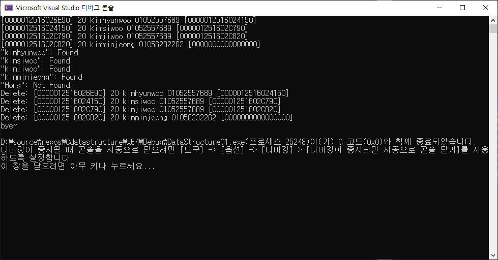

# 자료구조

자료구조란 결국 DBMS의 역할을 코드 내에서 하는것이라 생각한다.

그렇다면 데이터를 검색하고, 추가하고, 삭제하고 등등의 행위를 할때 이 데이터를 구분할만한 무언가가 필요하다.


이것을 Key라 하며 Key는 중복되서는 안된다.


또한 자료구조내의 데이터들은 정렬되어 있어야하는데 이는 특정한 범위나 데이터를 통해 원하는 데이터를 찾기 쉽게 하기 위해서이다.


내 허접한.. LinkedList에서는 이름을 Key로 잡는다.

이름을 기준으로 검색하고 삭제함을 구현하며 선형구조이기 때문에 그냥 무식하게 나올때까지 뒤져야한다.


### 검색

```c
USERDATA* SearchByName(const char* name) {
	USERDATA* iter = g_pHeadNode;

	while (iter != NULL)
	{
		if (!strcmp(iter->name, name)) {
			printf("\"%s\": Found\n", name);
			return iter;
		}
		iter = iter->pNext;
	}
	printf("\"%s\": Not Found\n", name);
	return NULL;
}
```

이름을 기준으로 노드를 찾고 못찾았다면 not found 출력한다.

이때 모든 테스트 노드와 존재 하지 않는 데이터에 대해서도 조사해야한다.


```c
int main() {
	InitDummyData();
	PrintList();
	SearchByName("kimhyunwoo");
	SearchByName("kimsiwoo");
	SearchByName("kimjiwoo");
	SearchByName("kimminjeong");
	SearchByName("Hong");
	ReleaseList();
	puts("bye~");
}
```


다음과 같이 작성시 결과는



위와 같다.


### 삭제

삭제는 조금더 복잡하다.

내 링크드 리스트에는 prev 포인터가 존재하지 않기 때문에 항상 peek 해서 다음 노드에 있는지 찾아보고

그 이후 진행해야한다.

이때 prev 노드에 대한 정보를 담고 있는 포인터를 따라 하나둬서 중간을 비우고 다시 잘 연결해야한다.

```c
//내버전
int deleteByName(const char*name) {
	USERDATA* current = g_pHeadNode, *prev = g_pHeadNode;

	if (!strcmp(g_pHeadNode->name, name)) {
		g_pHeadNode = g_pHeadNode->pNext;
		free(current);
		return 1;
	}

	current = current->pNext;

	while (current->pNext != NULL) {
		if (!strcmp(current->name, name)) {
			prev->pNext = current->pNext;
			free(current);
			return 1;
		}
		prev = current;
		current = current->pNext;
	}

	return -1;
}
```


위 버전을 보니 코드가 겹치는 부분이 존재한다.

바로 searchByName 코드랑 이름을 찾는 파트가 겹치는데 해당 코드에서는 prev값 또한 중요하니 prev포인터도 넘겨서 같이 값을 받아오도록 수정 할수 있을거같다.

```c
USERDATA* SearchToReomve(USERDATA**ppPrev,const char* name) {
	USERDATA* current = g_pHeadNode;
	*ppPrev = g_pHeadNode;

	if (!strcmp(g_pHeadNode->name, name)) {
		return g_pHeadNode;
	}

	current = current->pNext;

	while (current->pNext != NULL) {
		if (!strcmp(current->name, name)) {
			return current;
		}
		*ppPrev = current;
		current = current->pNext;
	}

	return NULL;
}

void deleteByName(const char*name) {
	USERDATA* current, * prev;

	current = SearchToReomve(&prev, name);

	if (current == prev)
	{
		g_pHeadNode = g_pHeadNode->pNext;
		free(current);
		return;
	}

	prev->pNext = current->pNext;
	free(current);
	return;
}
```

모듈을 2개로 나눠서 찾아오는 함수와 처리하는 함수로 나누니

좀더 깔끔해졌다.


### 더미노드

현재 코드의 제일 큰 문제점은 노드를 처리함에 있어서 헤더와 일반 노드를 구분해야한다는 점이다.

이 때문에 일관성이 떨어지고 조금더 복잡해진다.

따라서 더미노드를 둬서 첫번째 노드부터 모두 같은 방식으로 작동되게끔 하고 더불어 짜잘한 오류 및 리펙토링을 진행하였다.


```c
//single linkedlist 
#include<stdio.h>
#include <stdlib.h>
#include<conio.h>
#include<string.h>

typedef struct _userdata {
	int age;
	char name[32];
	char phone[32];
	struct _userdata* pNext;
}USERDATA;

//USERDATA* g_pHeadNode;
USERDATA g_HeadNode = { 0,"__DummyNode__","_DummyNode_",NULL };

typedef enum MY_MENU { EXIT, NEW, SEARCH, PRINT, REMOVE }MY_MENU;

MY_MENU PrintMenu() {
	MY_MENU input = 0;

	system("cls");
	printf("[1]New\t[2]Search\t[3]Print\t[4]Remove\t[0]Exit\n:");
	scanf_s("%d%*c", &input);
	return input;
}

void PrintList() {
	USERDATA* iter = g_HeadNode.pNext;

	while (iter != NULL)
	{
		printf("[%p] %d %s %s [%p]\n",
			iter,
			iter->age, iter->name, iter->phone,
			iter->pNext);
		iter = iter->pNext;
	}
}

USERDATA* SearchByName(const char* name) {
	USERDATA* iter = g_HeadNode.pNext;

	while (iter != NULL)
	{
		if (!strcmp(iter->name, name)) {
			printf("\"%s\": Found\n", name);
			return iter;
		}
		iter = iter->pNext;
	}
	printf("\"%s\": Not Found\n", name);
	return NULL;
}
USERDATA* SearchToRemove(const char* name) {
	USERDATA* current = g_HeadNode.pNext;
	USERDATA* pPrev = &g_HeadNode;


	while (current != NULL) {
		if (!strcmp(current->name, name)) {
			return pPrev;
		}
		pPrev = current;
		current = current->pNext;
	}
	printf("SearchToRemove() : not found %s\n", name);
	return current;
}

int deleteByName(const char* name) {
	USERDATA* current = NULL, * pPrev = NULL;

	pPrev = SearchToRemove(name);
	
	if (pPrev == NULL)
	{
		printf("deleteByName() : can't delete %s\n", name);
		return -1;
	}

	current = pPrev->pNext;
	pPrev->pNext = current->pNext;

	printf("Remove: [%p] %d %s %s [%p]\n",
		current, current->age, current->name, current->phone, current->pNext);
	current->pNext = NULL;
	free(current);
	return 1;
}


void AppendList(int age, const char* name, const char* phone) {
	USERDATA* newNode = (USERDATA*)malloc(sizeof(USERDATA));

	
	newNode->age = age;
	strcpy_s(newNode->name, sizeof(newNode->name), name);
	strcpy_s(newNode->phone, sizeof(newNode->phone), phone);
	newNode->pNext = NULL;

	USERDATA* iter = &g_HeadNode;
	while (iter->pNext != NULL) {
		iter = iter->pNext;
	}

	iter->pNext = newNode;
}
void InitDummyData() {
	AppendList(20, "kimhyunwoo", "01052557689");
	AppendList(20, "kimsiwoo", "01052557689");
	AppendList(20, "kimjiwoo", "01052557689");
	AppendList(20, "kimminjeong", "01056232262");
}

void ReleaseList(){
	USERDATA* pTmp = g_HeadNode.pNext;
	USERDATA* pDelete;

	while (pTmp != NULL) {
		pDelete = pTmp;
		pTmp = pTmp->pNext;
		printf("Delete: [%p] %d %s %s [%p]\n",
			pDelete,
			pDelete->age, pDelete->name, pDelete->phone,
			pDelete->pNext);

		pDelete->pNext = NULL;
		free(pDelete);
	}

	g_HeadNode.pNext = NULL;
}

void run() {
	MY_MENU menu = 0;

	while (menu = PrintMenu()) {
		switch (menu) {
		case NEW:
			//AppendList();
			break;
		case SEARCH:
			break;
		case PRINT:
			PrintList();
			break;
		case REMOVE:
			break;
		default:
			break;
		}
	}
}


void Test01() {
	puts("Test01()============================");
	AppendList(20, "kim", "010-1111-1111");
	AppendList(20, "Lee", "010-1111-2222");
	AppendList(20, "Hong", "010-1111-3333");
	PrintList();
	deleteByName("kim");
	ReleaseList();
	putchar('\n');
}

void Test02() {
	puts("Test02()============================");
	AppendList(20, "kim", "010-1111-1111");
	AppendList(20, "Lee", "010-1111-2222");
	AppendList(20, "Hong", "010-1111-3333");
	PrintList();
	deleteByName("Lee");
	AppendList(20, "Lee", "010-1111-2222");
	ReleaseList();
	putchar('\n');
}
void Test03() {
	puts("Test03()============================");
	AppendList(20, "kim", "010-1111-1111");
	AppendList(20, "Lee", "010-1111-2222");
	AppendList(20, "Hong", "010-1111-3333");
	PrintList();
	deleteByName("Hong");
	ReleaseList();
	putchar('\n');
}

int main() {
	Test01();
	Test02();
	Test03();
}
```

