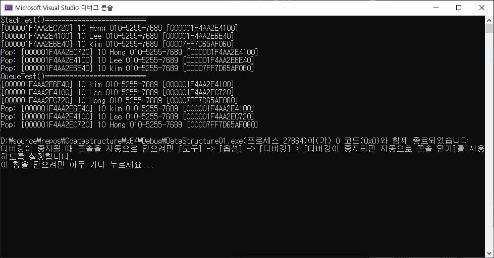

# 더블 링크드 리스트

싱글 링크드 리스트를 구현했으니 이번에는 더블 링크드 리스트를 구현한다.

 

노드에 pPrev 포인터를 하나 추가하고

전역변수 g_pTailNode를 추가한뒤 약간의 로직만 손봤다.


```c
#include<stdio.h>
#include <stdlib.h>
#include<conio.h>
#include<string.h>

typedef struct _userdata {
	int age;
	char name[32];
	char phone[32];
	struct _userdata* pNext;
	struct _userdata* pPrev;
}USERDATA;

//USERDATA* g_pHeadNode;
USERDATA g_HeadNode = { 0,"__DummyHead__" };
USERDATA g_TailNode = { 0,"__DummyTail__" };

typedef enum MY_MENU { EXIT, NEW, SEARCH, PRINT, REMOVE }MY_MENU;

MY_MENU PrintMenu() {
	MY_MENU input = 0;

	system("cls");
	printf("[1]New\t[2]Search\t[3]Print\t[4]Remove\t[0]Exit\n:");
	scanf_s("%d%*c", &input);
	return input;
}

void PrintList() {
	USERDATA* iter = g_HeadNode.pNext;

	while (iter != &g_TailNode)
	{
		printf("[%p] %d %s %s [%p]\n",
			iter,
			iter->age, iter->name, iter->phone,
			iter->pNext);
		iter = iter->pNext;
	}
}
void PrintListReverse() {
	USERDATA* iter = g_TailNode.pPrev;

	while (iter != &g_HeadNode)
	{
		printf("[%p] %d %s %s [%p]\n",
			iter,
			iter->age, iter->name, iter->phone,
			iter->pPrev);
		iter = iter->pPrev;
	}
}
void AppendList(int age, const char* name, const char* phone) {
	USERDATA* newNode = (USERDATA*)malloc(sizeof(USERDATA));


	newNode->age = age;
	strcpy_s(newNode->name, sizeof(newNode->name), name);
	strcpy_s(newNode->phone, sizeof(newNode->phone), phone);
	newNode->pNext = NULL;
	newNode->pPrev = NULL;

	
	
	newNode->pNext =&g_TailNode;
	newNode->pPrev = g_TailNode.pPrev;

	g_TailNode.pPrev->pNext = newNode;
	g_TailNode.pPrev = newNode;
}

USERDATA* SearchByName(const char* name) {
	USERDATA* iter = g_HeadNode.pNext;

	while (iter != &g_TailNode)
	{
		if (!strcmp(iter->name, name)) {
			printf("\"%s\": Found\n", name);
			return iter;
		}
		iter = iter->pNext;
	}
	printf("\"%s\": Not Found\n", name);
	return NULL;
}

USERDATA* SearchToRemove(const char* name) {
	USERDATA* current = g_HeadNode.pNext;


	while (current != &g_TailNode&&current!=NULL) {
		if (!strcmp(current->name, name)) {
			return current;
		}
		current = current->pNext;
	}
	printf("SearchToRemove() : not found %s\n", name);
	return current;
}

void DeleteNode(USERDATA*target) {
	USERDATA * pPrev = NULL, * pNext;
	
	if (target == NULL)
		return;
	

	pPrev = target->pPrev;
	pNext = target->pNext;

	pPrev->pNext = pNext;
	pNext->pPrev = pPrev;

	printf("Remove: [%p] %d %s %s [%p]\n",
		target, target->age, target->name, target->phone, target->pNext);
	target->pNext = NULL;
	free(target);

	return;
}

void InitList() {
	g_HeadNode.pNext = &g_TailNode;
	g_TailNode.pPrev = &g_HeadNode;
}

void ReleaseList() {
	USERDATA* pTmp = g_HeadNode.pNext;
	USERDATA* pDelete;

	while (pTmp != &g_TailNode && pTmp != NULL) {
		pDelete = pTmp;
		pTmp = pTmp->pNext;
		printf("Delete: [%p] %d %s %s [%p]\n",
			pDelete,
			pDelete->age, pDelete->name, pDelete->phone,
			pDelete->pNext);

		pDelete->pNext = NULL;
		pDelete->pPrev = NULL;
		free(pDelete);
	}

	InitList();
}


void InitDummyData() {
	AppendList(20, "kimhyunwoo", "01052557689");
	AppendList(20, "kimsiwoo", "01052557689");
	AppendList(20, "kimjiwoo", "01052557689");
	AppendList(20, "kimminjeong", "01056232262");
}


void run() {
	MY_MENU menu = 0;

	while (menu = PrintMenu()) {
		switch (menu) {
		case NEW:
			//AppendList();
			break;
		case SEARCH:
			break;
		case PRINT:
			PrintList();
			break;
		case REMOVE:
			break;
		default:
			break;
		}
	}
}


void Test01() {
	puts("Test01()============================");
	AppendList(20, "kim", "010-1111-1111");
	AppendList(20, "Lee", "010-1111-2222");
	AppendList(20, "Hong", "010-1111-3333");
	PrintList();
	DeleteNode(SearchToRemove("kim"));
	PrintList();
	ReleaseList();
	putchar('\n');
}

void Test02() {
	puts("Test02()============================");
	AppendList(20, "kim", "010-1111-1111");
	AppendList(20, "Lee", "010-1111-2222");
	AppendList(20, "Hong", "010-1111-3333");
	PrintList();
	DeleteNode(SearchToRemove("Lee"));
	AppendList(20, "Lee", "010-1111-2222");
	ReleaseList();
	putchar('\n');
}
void Test03() {
	puts("Test03()============================");
	AppendList(20, "kim", "010-1111-1111");
	AppendList(20, "Lee", "010-1111-2222");
	AppendList(20, "Hong", "010-1111-3333");
	PrintList();
	DeleteNode(SearchToRemove("Hong"));
	ReleaseList();
	putchar('\n');
}

int main() {
	InitList();
	Test01();
	Test02();
	Test03();
}
```


문제없이 정상 작동함을 확인할수 있다.

# 스택과 큐

<스택>

헤드로 집어넣고 헤드로 뺀다면 스택이다.


<큐>

테일로 집어넣고 테일로 뺀다면 큐이다.


매우 간단해서 너무 허무하다...

```c
int isEmpty() {
	return g_HeadNode.pNext == &g_TailNode;
}
void Push(USERDATA* item) {
	USERDATA* newNode = (USERDATA*)malloc(sizeof(USERDATA));


	memcpy(newNode, item, sizeof(USERDATA));

	newNode->pNext = NULL;
	newNode->pPrev = NULL;

	USERDATA* pNextNode = g_HeadNode.pNext;

	newNode->pNext = pNextNode;
	newNode->pPrev = &g_HeadNode;

	g_HeadNode.pNext = newNode;
	pNextNode->pPrev = newNode;
}

USERDATA* Pop() {
	if (isEmpty())
		return NULL;

	USERDATA* pPop = g_HeadNode.pNext;

	g_HeadNode.pNext = pPop->pNext;
	pPop->pNext->pPrev = &g_HeadNode;

	printf("Pop: [%p] %d %s %s [%p]\n",
		pPop,
		pPop->age, pPop->name, pPop->phone,
		pPop->pNext);

	pPop->pNext = NULL;
	pPop->pPrev = NULL;

	return pPop;
}

USERDATA* Dequeue() {
	return Pop();
}

void Enqueue(USERDATA* pUser) {
	AppendList(pUser->age, pUser->name, pUser->phone);
}

void StackTest() {
	puts("StackTest()=========================");
	USERDATA tmp1 = { 10,"kim","010-5255-7689" };
	USERDATA tmp2 = { 10,"Lee","010-5255-7689" };
	USERDATA tmp3 = { 10,"Hong","010-5255-7689" };
	Push(&tmp1);
	Push(&tmp2);
	Push(&tmp3);
	PrintList();
	free(Pop());
	free(Pop());
	free(Pop());

	PrintList();
	ReleaseList();
}
void QueueTest() {
	puts("QueueTest()=========================");
	USERDATA tmp1 = { 10,"kim","010-5255-7689" };
	USERDATA tmp2 = { 10,"Lee","010-5255-7689" };
	USERDATA tmp3 = { 10,"Hong","010-5255-7689" };
	Enqueue(&tmp1);
	Enqueue(&tmp2);
	Enqueue(&tmp3);
	PrintList();
	free(Dequeue());
	free(Dequeue());
	free(Dequeue());

	PrintList();
	ReleaseList();
}

int main() {
	InitList();
	StackTest();
	QueueTest();
}
```


앞서 구현했던 코드들을 재사용해서 만들어보면 결과는 다음과같다.


