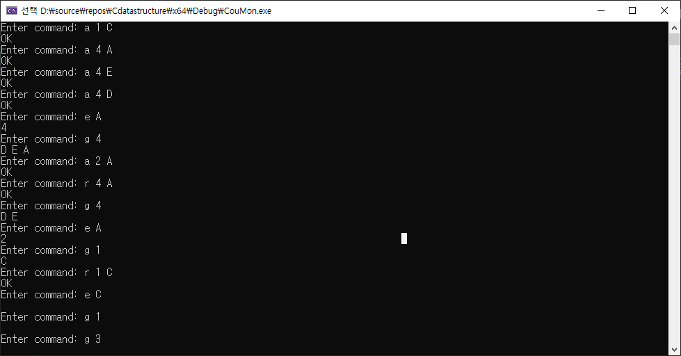

# 리스트

> 다수의 품명(品名)이나 인명(人名) 등을 기억하거나 점검하기 쉽도록 특별한 순서로 적어 놓은 것. - Oxford Languages


# 프로젝트


### 문제

인터넷 쿠폰 사이트 "쿠몬"의 예를 사용하여 리스트 확장에서 공부한 공유 개념을 다중연결리스트 방식으로 구현해보자.


쿠몬의 총 가입자 수는 NG명 이며, 제공되는 쿠폰의 종류는 NE 종이다.

초기 데이터구조는 가입자의 배열 Groups와 쿠폰의 배열 Elements로 구성된다.

어떤 가입자 g가 어떤 쿠폰 e를 구매하면 삽입 알고리즘을 통해 다중연결리스트 내에 (e,g) 노드가 생성된다.

문제를 단순화하기 위해, 쿠폰 보유는 가입자당 종별 최대 1매로 제한한다.

쿠폰 구매를 취소하거나 쿠폰 사용이 완료되면 삭제 알고리즘을 통해 해당 (e,g) 노드가 삭제된다.


### 프로그래밍 지침

- NG = 5, NE = 4를 사용하고 가입자 명은 {A, B, C, D, E}를, 쿠폰 명은 {1, 2, 3, 4}를 사용하라
- 삽입,삭제,열람을 하나의 프로그램으로 묶어서 구현하라
- 주함수에서 반복적으로 사용자의 명령코드 a(dd) 또는 r(emove)에 따라 해당 메소드를 호출하여 처리하는 방식으로 작성하라.

- e(traverseSharedElements) 및 g(traverseSharedGroups) 명령 코드도 수행하도록 하라


### 실행예

```c
(input)				(output)
a 1 C				OK
a 4 A				OK
a 4 E				OK
a 4 D				OK
e A					4
g 4					A D E (순서 무관)
a 2 A				OK
e A					2 4
r 4 A				OK
g 4					D E
e A					2
g 1					C
r 1 C				OK
e C					0
g 1					0
g 3					0
```


### 문제풀이


#### 1.메인함수

메인함수에 기본틀 부터 작성하였다.

```c
#define _CRT_SECURE_NO_WARNINGS 

#include<stdio.h>

#define TRUE 1
#define FALSE 0

int main() {
	char op, g;
	int isRun = TRUE, e;

	while (isRun) {
		scanf(" %c", &op);

		switch (op) {
		case 'a':
			scanf("%d %c", &e, &g);
			printf("addShare! e = %d, g = %c\n", e, g);
			break;
		case 'r':
			scanf("%d %c", &e, &g);
			printf("removeShare!\n");
			break;
		case 'e':
			scanf(" %c", &g);
			printf("traverse shared elements! g = %c\n", g);
			break;
		case 'g':
			scanf("%d", &e);
			printf("traverse shared groups!\n");
			break;
		default:
			printf("error : invalid input!\n");
			isRun = FALSE;
			break;
		}
	}
}
```


#### 2.노드 정의

노드는 2가지의 데이터를 가져야한다.

1. Group명
2. 쿠폰명

또한 두가지 리스트에 연결되어야 하니 포인터도 2개를 가져야한다.

```c
//Node.h
#pragma once

typedef int Element;
typedef char Group;

typedef struct _node {
	Element e;
	Group g;

	struct _node *nextElement;
	struct _node* nextGroup;
}Node;

Node* makeNode(Element e, Group g);
```


```c
//Node.c
#include "Node.h"
#include<stdlib.h>
#include<stdio.h>

Node* makeNode(Element e, Group g)
{
    Node* newNode = (Node*)malloc(sizeof(Node));
    newNode->e = e;
    newNode->g;
    newNode->nextElement = NULL;
    newNode->nextGroup = NULL;
    return newNode;
}
```


#### 3. 리스트 정의

처음에는 링크드 리스트 기반으로 만드려고 하였지만

문제에서 NE와 NG의 값을 고정시킨 만큼 배열 기반 리스트로 먼저 구현을 해보려 했다.

node안에 nextElement와 nextGroup이 존재하기 때문에 리스트 하나를 정의해서 무언가 공통적으로 사용케 하기는 힘들다고 생각했다.


따라서 문제에서 언급한 매소드내에서 알아서 처리 하게끔 구현했다. 추후 c++로 다시 리팩토링할때 고쳐보려한다.


``` c
typedef int Bool;
#define TRUE 1
#define FALSE 0
#define NE 4
#define NG 5

Node *Elements[NE];
Node *Groups[NG];

void initShare();
void traverseShareElements(Group g);
void traverseShareGroup(Element e);
Bool addShare(Element e, Group g);
Bool removeShare(Element e, Group g);
```


또한 main함수를 다시금 바꿨다.

```c
int main() {
    char op, g;
    int isRun = TRUE, e;

    initShare();
    while (isRun) {
        printf("Enter command: ");
        if (scanf(" %c", &op) != 1) {
            printf("Error : invalid input!\n");
            break;
        }

        switch (op) {
        case 'a':
            if (scanf("%d %c", &e, &g) == 2) {
                if (addShare(e, g))
                    printf("OK\n");
                else
                    printf("Error : invalid input!\n");
            }
            else {
                printf("Error : invalid input!\n");
                while (getchar() != '\n'); // flush
            }
            break;

        case 'r':
            if (scanf("%d %c", &e, &g) == 2) {
                if (removeShare(e, g))
                    printf("OK\n");
                else
                    printf("Error method: invalid input!\n");
            }
            else {
                printf("Error scanf : invalid input!\n");
                while (getchar() != '\n'); // flush
            }
            break;

        case 'e':
            if (scanf(" %c", &g) == 1) {
                traverseShareElements(g);
            }
            else {
                printf("Error : invalid input!\n");
                while (getchar() != '\n');
            }
            break;

        case 'g':
            if (scanf("%d", &e) == 1) {
                traverseShareGroup(e);
            }
            else {
                printf("Error : invalid input!\n");
                while (getchar() != '\n');
            }
            break;

        default:
            printf("Error : invalid input!\n");
            isRun = FALSE;
            break;
        }
    }

    return 0;
}
```

#### 구현

```c
void initShare()
{
	for (int i = 0; i < NE; i++) {
		Elements[i] = makeNode('A' + i, 0);
		Elements[i]->nextElement = NULL;
		Elements[i]->nextGroup = Elements[i];
	}

	for (int i = 0; i < NG; i++) {
		Groups[i] = makeNode(0, 1 + i);
		Groups[i]->nextElement = Groups[i];
		Groups[i]->nextGroup = NULL;
	}
}

void traverseShareElements(Group g)
{
	Node* head = Groups[g - 'A'];
	Node* pNext = head->nextElement;

	while (pNext != head) {
		printf("%d ", pNext->e);
		pNext = pNext->nextElement;
	}
	putchar('\n');
}

void traverseShareGroup(Element e)
{
	Node* head = Elements[e - 1];
	Node* pNext = head->nextGroup;

	while (pNext != head) {
		printf("%c ", pNext->g);
		pNext = pNext->nextGroup;
	}
	putchar('\n');
}

Bool addShare(Element e, Group g)
{
	Node* p = makeNode(e, g);
	Node* HG = Groups[g - 'A'];
	p->nextElement = HG->nextElement;
	HG->nextElement = p;
	Node* HE = Elements[e - 1];
	p->nextGroup = HE->nextGroup;
	HE->nextGroup = p;
	return TRUE;
}

Bool removeShare(Element e, Group g) {
	Node* HG = Groups[g - 'A'], * HE = Elements[e - 1], * rpos;

	while (HG->nextElement != HG && HG->nextElement->e != e) {
		HG = HG->nextElement;
	}
	while (HE->nextGroup != HE && HE->nextGroup->g != g) {
		HE = HE->nextGroup;
	}
	rpos = HG->nextElement;

	HG->nextElement = rpos->nextElement;
	HE->nextGroup = rpos->nextGroup;
	free(rpos);

    return TRUE;
}
```


### 결과


